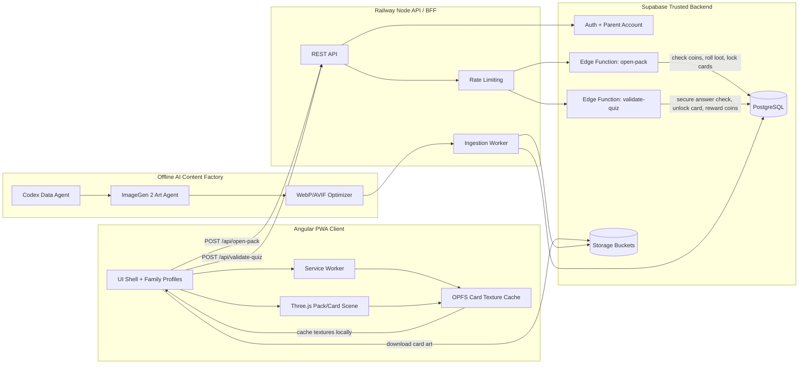

## אוספים עובדות: Product & Technical Specification (v3.0 - Playful Edition)

This document provides a comprehensive full-stack specification for **אוספים עובדות**, an educational trading card collection game (TCG) designed as a Progressive Web App (PWA) for ages 3-99. This revision integrates the core educational/collection loop with a significantly more playful, vibrant, and whimsical aesthetic, replacing traditional high-fidelity CCG elements with soft textures, cartoony art, and toy-like interactions.

### 1. Introduction & Product Vision

**אוספים עובדות** is designed to capture the excitement of digital card collecting and pack opening while providing an age-adaptive educational challenge. The defining characteristic of v3.0 is a complete stylistic shift to a playful, joyful, and "juice-heavy" experience, ensuring interactions feel bouncy and rewarding for all ages.

#### 1.0 Product Language Rules

* **עברית תמיד:** כל חוויית המשתמש, הקלפים, החבילות, החנות, החידונים, הכפתורים והנכסים הגרפיים הם בעברית כברירת מחדל. כל נכס תמונה סופי חייב להיווצר מראש בעברית; אסור לייצר נכס באנגלית ואז להפוך אותו לעברית או להדביק עליו שכבת תרגום.
* **תמונות תמיד כרינדור:** קלף, גב קלף וחבילה סופיים הם תמיד קבצי תמונה מרונדרים ועצמאיים. HTML/CSS יכולים לשמש לתצוגה, אנימציה, אבטיפוס או קומפוזיציה בדף האפיון בלבד, אבל אינם מקור הנכס הסופי.
* **אין "סשן":** המונח המוצרי הוא **עונה** בלבד. אין להשתמש ב"סשן" בטקסטי מוצר, UI, קלפים, חבילות או אפיון.
* **חבילה בגודל קלף:** חבילת קלפים היא נכס באותו יחס וגודל ויזואלי של קלף, כדי שתוכל להסתובב, להיפתח ולהופיע באותו עולם תלת-ממדי.
* **גב קלף כתמונה:** החלק האחורי של קלף הוא asset תמונה מלא, לא CSS. ברירת המחדל היא גב עונתי אחיד לכל קלפי אותה עונה, למשל גב "עונה 1".
* **נכס אחד בכל יצירה:** כל קלף וכל חבילה סופיים נוצרים כתמונת asset עצמאית בפרומפט/משימת יצירה נפרדת. אסור לייצר גיליון של כמה קלפים או כמה חבילות ואז לחתוך אותו לנכסים סופיים, כי זה מגדיל סיכון לטעויות כתיב וטקסט מעורבב. Contact sheet מותר רק אחרי שיש נכסים עצמאיים, לצורך סקירה ואישור.

#### 1.1 Core Gameplay Loop

1. **Choose Content Domain Pack:** Players choose or earn a pack built around a content domain, such as Animals, Crystals, Space, Robotics, Israeli History, or IDF/Israeli Society.
2. **Open Pack:** Engage in a polished pack-opening ceremony. The pack contains cards from that domain.
3. **Reveal Topic Cards:** Each revealed card represents one concrete topic inside the domain, such as Shark, Amethyst, Moon, Tank, or Rescue Unit.
4. **Read Facts:** A card contains short Hebrew facts about its topic. The card image itself is an information card, not a quiz card.
5. **Tap To Test:** At any point, the player can tap a locked card to start an age/difficulty-adaptive quiz based only on that card's facts.
6. **Collect & Earn:** Successfully solving the quiz unlocks the full card in the **Binder** and awards **Brain Coins**.

#### 1.1.1 Content Domain Model

The product is organized around **domains**, **packs**, and **topic cards**:

* **Domain:** A broad learning category, e.g., חיות, קריסטלים, חלל, רובוטיקה, ישראל, צה"ל.
* **Pack:** A purchasable/earnable set of **10 topic cards** from one domain, e.g., "חבילת חיות", "חבילת קריסטלים", "חבילת צה״ל".
* **Card:** A specific topic within the domain, e.g., "כריש", "אמטיסט", "יחידת חילוץ". The card image includes factual information only. The quiz exists as an interactive flow opened by tapping the card.
* **Difficulty Layer:** The same card topic can support multiple quiz difficulties. Difficulty changes the question and answer style, not the card's core identity.
* **Binder:** Collection is organized by domain and pack, so the player can see progress like "12/20 חיות נאספו".

#### 1.2 The "Family Profile" Model

The game supports multi-generational play under a single parental account, adapting content dynamically via individual profiles:

* **Tier 1 (Ages 1-5): Sensory Unlocking.** Visual-only questions about the topic (e.g., "איפה הכריש?"). Focus on recognition, colors, shapes, and cheerful sounds.
* **Tier 2 (Ages 6-12): Child Trivia.** Hebrew reading and multiple-choice questions based on the card facts.
* **Tier 3 (Ages 13+): Thought-Provoking Subjects.** Deeper facts, context, comparison questions, and advanced topics.

---

### 2. Technical Stack

To achieve the desired high performance and "juice" within a PWA framework, the following stack is mandated. The baseline target is smooth 60 FPS on mainstream mobile devices, with 120 FPS and WebGPU effects treated as progressive enhancement on capable hardware.

* **Frontend Framework:** Angular (v19+) utilizing **Signals** for reactive UI state (especially economy counters).
* **3D Rendering (The Juice):** Three.js using WebGL as the baseline renderer, with WebGPU/TSL effects enabled where available.
* **PWA Framework:** Angular Service Worker (Workbox).
* **Backend/Database/BAAS:** Supabase (PostgreSQL, Edge Functions, Auth, Storage).
* **Hosting/Deployment:** Railway.
* **Offline Content Factory (Asset Generation):** Codex & ImageGen 2 (pre-generation pipeline).

---

### 3. Application Architecture

The system utilizes a decoupled, server-authoritative architecture to enforce data integrity and game economy security.

* **Client (Angular PWA):** Presentation layer. Displays the 3D world, handles user input (drag/drop physics), and requests server actions. *Crucially, the client does not make RNG decisions or validate quizzes.*
* **Railway Backend:** Node.js/TypeScript API layer for orchestration, rate-limiting, and interfacing with the Supabase project.
* **Supabase (BAAS):**
  * **PostgreSQL:** Source of truth for user collections, card data, drop rates, and seasonal metadata.
  * **Edge Functions (Deno):** Executes all secure game logic, including Loot Rolls and Quiz Validation.
  * **Storage (Buckets):** Hosts optimized card assets (WebP/AVIF).

#### 3.1 Mermaid Architecture Scheme



---

### 4. Frontend & UI/UX (The Playful "Juice")

The UI/UX must prioritize tactile feedback, bouncy animations, and cheerful visuals.

#### 4.1 Design Language

* **Visual Style:** Rounded corners, soft shadows, bright primary and secondary colors (playful palette), toy-like plastic textures.
* **Icons:** Cheerful SVG icons (e.g., chunky plastic coin for Brain Coins).

#### 4.2 Three.js / WebGPU (TSL Shading)

The 3D environment is critical for "Hearthstone-level polish."

* **Playful Shaders:** Optimized confetti and bubble particle shaders used for pack opening bursts (TSL compute shaders).
* **Material Rendering:** Cards are 3D meshes with depth, rendered to look like soft, polished toy plastic (using PBR materials in Three.js).
* **Gyroscope Parallax:** Utilizing mobile device gyroscope data to slightly tilt the card meshes based on device orientation, creating a 3D depth effect within the card art.
* **Legendary Cards:** Feature playful bubbly energy effects venting from the bottom corners, replacing dramatic energy flares.

#### 4.3 PWA Features (PWA 2.0)

* **Offline First:** The "Binder" must be cached and browseable offline. Service Workers cache the app shell, while **OPFS (Origin Private File System)** is used as a virtual hard drive to store hundreds of WebP card textures locally.
* **Installation:** Strict manifest integration for a native-like "Add to Homescreen" prompt, hiding the browser UI.

#### 4.4 Haptics & Sound Design (Playful Feedback)

* **Haptics (Navigator.vibrate / web-haptics):**
  * Low-frequency hum while dragging packs (soft spring physics).
  * A joyful, bright vibration "pop" when a pack opens.
  * Rhythmic, soft "thud" vibrations when cards land on the mat.
* **Sound:** Bright chimes for UI clicks, cartoonish bounce sounds, joyful music.

#### 4.5 Card Look Candidates

The final card visual language is still open. The companion HTML spec presents 9 visual options. Card fronts carry the subject, title, rarity, learning category, skill tag, and concise educational fact. Card backs are season-based, starting with a shared **Season 1** back for the first content set.

1. **Jelly Pop:** glossy, bouncy plastic with rounded frame geometry.
2. **Storybook Toy:** soft paper, watercolor warmth, gentle educational feel.
3. **Smart Arcade:** bright tech frame with playful neon energy.
4. **Plush Binder:** fabric-like collectible with stitched toy details.
5. **Bubble Science:** translucent capsule feel, clean and curious.
6. **Clay Heroes:** chunky 3D clay/plastic look with strong toy shadows.
7. **Mini Museum:** cleaner premium collectible style for broad ages.
8. **Sticker Storm:** scrapbook/sticker energy with playful layering.
9. **Vault Legendary:** rainbow rare treatment for high-rarity cards and vault moments.

Additional ornate TCG-inspired front candidates. These explore stronger collectible-card UX: top-left cost gem, central illustrated portrait, curved title banner, parchment rules text, rarity/type metadata, and bottom stat/reward badges:

10. **Arcane Lesson:** classic game-card structure with cost, learning effect, and stat badges.
11. **Tavern Quest:** warm fantasy-table framing with story companion energy.
12. **Crystal Lab:** gem-framed science card with faceted subject art.
13. **Hero Badge:** younger-player shape hero with simple powers and bold readability.
14. **Cosmic Vault:** premium legendary frame with dark cosmic art treatment.
15. **Field Notes:** nature-study card using ornate framing but calmer learning tone.
16. **Retro Pixel:** digital sprite card for coding, sequencing, and game-like topics.
17. **Toy Relic:** artifact/engine card for systems, gears, and engineering concepts.
18. **Quiz Champion:** color-spell card with bright power badges and quiz streak reward.

#### 4.6 Booster Pack Visuals & Opening Animation

Booster packs should use the familiar physical TCG foil-pack language while remaining fully original to אוספים עובדות:

* **Pack Structure:** Crimped top/bottom wrapper, bold Hebrew **אוספים עובדות** logo, age badge, Hebrew learning-card banner, central subject art, set name, and Hebrew card-count footer.
* **Season/Set Branding:** Packs are themed by active season/set, starting with Season 1 examples such as Splash Bots, Brain Burst, Cosmic Class, Crystal Lab, Code Carnival, and Gear Garden.
* **Opening Ceremony:** The pack should tear from the top, split left/right, release cards upward, and trigger confetti/haptic/sound feedback.
* **Implementation Target:** In production, the pack ceremony should be a Three.js mesh with foil material, crimped geometry, tear animation, card stack reveal, and rarity-sensitive particle effects.

#### 4.7 Production Rendering Recommendation

Research direction: final cards and packs should be **image/texture based with animation layers**, not CSS/SVG drawings. CSS/SVG examples in the HTML spec are technical layout templates only, not the final visual direction.

* **Cards:** Use structured card templates with fixed zones: reward badge, portrait art, title ribbon, type/subject line, fact text, rarity, and bottom collection stats. Render each final card front/back to an optimized image texture for the 3D scene and Binder, while retaining structured JSON for search, accessibility, and quiz logic.
* **Packs:** Use a high-resolution pack face texture per season/set, in the same aspect ratio and visual size as cards, mapped onto a Three.js foil wrapper mesh. The image handles branding/art polish; the mesh handles crimping, bending, tear-open, lighting, and parallax.
* **Opening Animation:** MVP can use CSS/Web Animations with image assets. Production should use Three.js: idle hover, drag-to-mat, shake/charge, tear or burst, card stack rise, face-down layout, rarity glow, tap-to-flip, and "Reveal All" for repeat openings.
* **UX Rule:** Opening should feel ceremonial the first time, but never become tedious. Always provide skip/reveal-all behavior after the moment lands.

#### 4.7.1 Premium Art Target

The current HTML card/pack examples are **wireframes for layout and anatomy**, not final-quality art. The production target should feel closer to premium digital CCGs: illustrated, dimensional, material-rich, and collectible.

* **Card Front Quality:** Each card needs generated or artist-produced hero art, a rendered frame, lighting/shadow passes, rarity-specific material treatment, and a polished title/rules area. CSS/SVG placeholder art is not sufficient for the final product.
* **Card Frame System:** Build one master 3D/2D frame system with layers: base frame, portrait mask, title ribbon, rules panel, cost gem, rarity gem, bottom learning-stat badges, foil overlay, and animated rarity particles.
* **Pack Quality:** Each booster pack needs a full face illustration with a hero subject, logo lockup, set logo, foil crimp texture, edge wear, highlight streaks, and material maps. Packs should be generated as art assets first, then mapped to animated 3D wrapper geometry.
* **Rarity Materials:** Common uses clean matte finish; Rare adds edge glow; Epic adds animated foil and gem shimmer; Legendary adds parallax art, animated border, and stronger reveal effects.
* **Pipeline Requirement:** The offline factory must render final assets as layered source files plus optimized runtime textures, not just raw generated images.
* **No CSS Final Art:** CSS can animate, position, and prototype. It must not be the final source of the card/pack look.
* **No Sheet Generation For Final Assets:** The factory must submit one generation job per final card or pack. Review sheets may be assembled later from finished assets, but cannot be the source image used to crop production cards.

#### 4.7.2 Original אוספים עובדות Card Language

The final card style must be premium but **not a direct fantasy-combat CCG clone**. אוספים עובדות should use its own learning-first collectible language:

* **No Combat Stats:** Avoid attack/health framing. Use learning stats such as **Quiz Tier**, **Brain Coin Reward**, **Mastery Stars**, **Curiosity**, **Focus**, or **Set Progress**.
* **Quiz-Lock Anatomy:** Cards can appear as "Locked" after pack reveal. The front remains a facts card. The app UI, not the image asset, shows the tap-to-test action, lock seal, and reward preview.
* **Information-Rich Topic Front:** Cards should carry enough learning and collection data to feel valuable: Hebrew topic title, domain, pack/set, rarity, age band, Brain Coin reward, mastery progress, 2-3 short factual bullets, card number, and collection/set progress. Do not place quiz questions on the card image.
* **Topic-Specific Content:** Each card is about a real content topic. Example: "כריש" includes shark facts; tapping the card opens a shark quiz. "צה״ל" or a specific IDF topic includes age-appropriate civic/historical facts; tapping opens a quiz. "קריסטלים" includes crystal/mineral facts; tapping opens a quiz.
* **Vault Identity:** Use motifs like vault seals, sticker tabs, toy-like gems, subject badges, learning ribbons, notebook panels, and magical archive frames instead of medieval combat stone frames.
* **Age-Tier Signal:** The card should visually support Junior, Child, and Teen/Adult quiz tiers without changing the whole layout.
* **Season-Based Back:** Backs are season branded, starting with **Season 1**, and should feel like collectible vault passes. Domain identity appears on the front/pack; the back can stay unified for the whole season.
* **Original Premium Direction:** The target is "premium magical learning collectible": rich, tactile, and collectible, but friendlier and more original than direct Hearthstone/Magic-style combat cards.

#### 4.7.3 Hebrew-First Asset System

All final user-facing card, pack, shop, quiz, and collection assets are **Hebrew-first** with RTL layout support.

* **Primary Language:** Hebrew is the default asset language for card fronts, card backs, pack fronts, quiz prompts, subject badges, reward labels, and store labels.
* **RTL Layout:** Card templates must support right-to-left text flow, right-aligned labels, Hebrew typography, mirrored layout where appropriate, and safe text boxes for long Hebrew words.
* **Typography:** Use Hebrew-capable display and UI typography inside the generated asset. Required Hebrew text must be part of the original generated image, not a later localization pass.
* **Native Hebrew Image Generation:** Prompt generation for card fronts, pack fronts, and backs must request the final Hebrew labels from the start: **"אוספים עובדות"**, pack name, age band, and card count. A generated asset containing English branding, fake Hebrew, mirrored Hebrew, or placeholder text is rejected and regenerated.
* **Bilingual Metadata:** The database stores Hebrew fields first, with optional English/internal fields for tooling: `title_he`, `subject_he`, `fact_he`, `quiz_prompt_he`, `set_name_he`, plus normalized internal IDs.
* **Examples:** "כריש", "חיות", "עונה 1", "חידון: קל", "גיל 6-8", "+12 מטבעות מוח", "חבילת חיות", "10 קלפי למידה".

#### 4.7.4 Example Hebrew Domains, Packs, and Cards

עונה 1 תתחיל עם 20 חבילות למידה. כל חבילה היא עולם תוכן, וכל חבילה מכילה 10 קלפי נושא. ה־200 תמונות הן קדמות הקלפים; בנוסף נדרשות 20 תמונות חבילה וגב עונתי אחד.

**ילדים קטנים - גילאי 3-5**

* **חיות חמודות:** חתול, כלב, ארנב, פיל, ג'ירפה, צב, דולפין, פרפר, פינגווין, כריש.
* **צבעים:** אדום, כחול, צהוב, ירוק, כתום, סגול, ורוד, חום, שחור ולבן, קשת צבעים.
* **צורות:** עיגול, ריבוע, משולש, מלבן, כוכב, לב, מעוין, אליפסה, משושה, ספירלה.

סטטוס חבילות:

* **צבעים:** סגור לעונה 1. קיימים חבילת תמונה, 10 קלפי תמונה, JSON שאלונים ו-manifest סגירה.
* **צורות:** סגור לעונה 1. קיימים חבילת תמונה, 10 קלפי תמונה, JSON שאלונים ו-manifest סגירה.

### Asset Generation Skill

נוצר skill מקומי קבוע ליצירת קלפים וחבילות באותו מבנה וסגנון פרימיום של עונה 1:

* Path: `/Users/orentzezana/.codex/skills/fact-collectors-card-pack-assets`
* שימוש: יצירת קלפי קדמה, חבילות, גב עונתי, פרומפטים, manifests ו-contact sheets.
* כלל מרכזי: כל נכס סופי הוא תמונת PNG/WebP מרונדרת, לא HTML/CSS.
* Reference מרכזי: `references/season-1-style.md`.
* Script עזר: `scripts/build_asset_prompts.py` מקבל JSON חבילה ומייצר פרומפטים עקביים.
* **כלי תחבורה:** אוטובוס, רכבת, מטוס, סירה, אופניים, טרקטור, כבאית, אמבולנס, חללית, רכבל.
* **פירות וירקות:** תפוח, בננה, תות, אבטיח, גזר, עגבנייה, מלפפון, ענבים, תפוז, תירס.
* **הגוף שלי:** עיניים, אוזניים, אף, פה, ידיים, רגליים, לב, שיניים, שיער, בטן.

**ילדים בינוניים - גילאי 6-9**

* **דינוזאורים:** טירנוזאורוס, טריצרטופס, סטגוזאורוס, ולוצירפטור, ברכיוזאורוס, פטרנודון, אנקילוזאורוס, דיפלודוקוס, פרזאורולופוס, מאובן.
* **חלל וכוכבים:** שמש, ירח, כדור הארץ, מאדים, צדק, שבתאי, אסטרונאוט, טיל, שביט, תחנת חלל.
* **ים ואוקיינוסים:** לווייתן, כריש, תמנון, מדוזה, שונית אלמוגים, צוללת, סוסון ים, צב ים, דג חשמל, גאות ושפל.
* **המצאות חשובות:** גלגל, נורה, טלפון, מצלמה, מחשב, אינטרנט, רובוט, דפוס, מצפן, מטוס.
* **מזג אוויר וטבע:** גשם, שלג, ברק, רוח, ענן, קשת בענן, הר געש, רעידת אדמה, נהר, יער.

**ילדים גדולים - גילאי 10-13**

* **גוף האדם ומדע:** מוח, לב, ריאות, שלד, שרירים, מערכת עיכול, דם, חיידקים, DNA, חיסון.
* **היסטוריה עולמית:** מצרים העתיקה, יוון העתיקה, רומא, ימי הביניים, דרך המשי, מהפכת הדפוס, גילוי אמריקה, המהפכה התעשייתית, זכויות אדם, עידן המחשב.
* **מדע וטכנולוגיה:** חשמל, מגנטיות, אור, קול, אנרגיה, כבידה, בינה מלאכותית, קוד, לווין, הדפסה תלת ממדית.
* **ישראל ומורשת:** ירושלים, הכנרת, ים המלח, הנגב, עברית, חגי ישראל, מגילת העצמאות, הכנסת, מדבר יהודה, חדשנות ישראלית.
* **בעלי חיים מסוכנים ומרתקים:** כריש לבן, תנין, נחש קוברה, עקרב, מדוזה קובייתית, דוב קוטב, נמר, עכביש אלמנה, צפרדע רעילה, לווייתן קטלן.

**מבוגרים - גילאי 14+**

* **צה"ל וביטחון:** חילוץ והצלה, מודיעין, חיל האוויר, חיל הים, חיל הרפואה, כיפת ברזל, לוחמה בסייבר, לוגיסטיקה, פיקוד העורף, אתיקה צבאית.
* **קריסטלים וגאולוגיה:** קוורץ, אמטיסט, טורמלין, פיריט, אובסידיאן, גרניט, בזלת, יהלום, מלח סלעים, מאובן מינרלי.
* **כלכלה וכסף:** תקציב, חיסכון, ריבית, אינפלציה, מניה, אג"ח, מסחר, בנק, מטבע דיגיטלי, סיכון ותשואה.
* **פסיכולוגיה וחשיבה:** זיכרון, קשב, הרגלים, רגשות, קבלת החלטות, הטיות חשיבה, מוטיבציה, אמפתיה, לחץ, למידה.
* **טכנולוגיות העתיד:** בינה מלאכותית, רובוטיקה, אנרגיה מתחדשת, מחשוב קוונטי, ביוטכנולוגיה, רכבים אוטונומיים, מציאות רבודה, סייבר, חקר החלל, ערים חכמות.
* **חבילת חלל:** ירח, מאדים, חללית, אסטרונאוט, מערכת השמש.
* **חבילת רובוטיקה:** חיישן, מנוע, זרוע רובוטית, אלגוריתם, רובוט עוזר.

#### 4.8 Card & Pack Product UX Rules

Research direction: אוספים עובדות should borrow the **clarity** of mature TCGs, not their complexity.

* **Card Anatomy Must Be Stable:** Every card front uses the same readable zones: reward badge, portrait window, title ribbon, subject/type line, fact panel, rarity indicator, and bottom stat/reward badges. Visual treatments may vary by rarity or set, but information placement should not jump. The quiz prompt is never printed on the card image.
* **Educational Stats Replace Combat Stats:** Bottom badges should represent learning-relevant values such as focus, curiosity, mastery reward, quiz difficulty, or Brain Coin reward. Avoid implying combat unless a future mode explicitly supports it.
* **Domain Pack Size:** A domain pack/set contains **10 topic cards**. The pack-opening ceremony may reveal all 10 as a set, while the quiz workload is paced by leaving cards locked until the player chooses to solve them.
* **Reveal Flow:** Pack opens into face-down cards. Cards reveal one at a time with rarity glow, then enter a locked state until solved. Provide **Reveal All** and **Skip Ceremony** after the first few openings.
* **Binder UX:** The Binder should support set progress, missing-card silhouettes, rarity filters, subject filters, duplicate handling, and offline browsing.
* **Accessibility:** Every motion-heavy step needs reduced-motion fallback, captions/subtitles for sound cues, non-haptic alternatives, large tap targets, and readable text on small screens.

---

### 5. Backend Logic & Security

The backend forces strict security on all mutable data.

#### 5.1 Server-Authoritative Loot (Supabase Edge)

1. Frontend calls `POST /api/open-pack {pack_id, profile_age}`.
2. Backend (Railway/Edge) validates the user's Brain Coin balance.
3. Edge Function executes the RNG logic against the server-side `Drop_Rates` table for the specified Set.
4. Selected cards are added to the user's `Inventory` table marked as "Locked."
5. Edge returns only the card IDs to the client to play the 3D reveal animation.

#### 5.2 Quiz Validation (Supabase Edge)

1. Frontend displays the age-appropriate quiz (stored in the DB `Cards` table, tailored by the factory).
2. Player submits chosen answer index.
3. Client sends `POST /api/validate-quiz {card_id, selected_answer_index}`.
4. Edge Function compares submission against the secure DB value (which is *never* sent to the client).
5. Edge updates the `Inventory` table row to "Unlocked: True" and increments the user's Brain Coin balance.

#### 5.3 Authentication (Phased Implementation)

* **Staging:** Frictionless entry. Generate an anonymous UUID stored in localStorage (or preferably a device-bound Passkey/Shadow Profile for better persistence). Progress is tracked against this ID.
* **Production:** Implement **Google OAuth** for the "Parent Account." A migration function links the local staging UUID data to the authenticated Google profile, permanently securing the collection.

#### 5.4 Economy Integrity & Auditability

All game-economy actions must be idempotent, auditable, and versioned.

* **Idempotency:** `open-pack` and `validate-quiz` require idempotency keys so refreshes, retries, and spotty mobile connections cannot duplicate rewards.
* **Economy Ledger:** Brain Coin and Magic Gem changes are written to an append-only ledger before profile balances are updated.
* **Drop Table Versioning:** Every pack opening stores the exact drop table version used for the roll.
* **Duplicate Handling:** Duplicates should convert into a transparent resource, such as Brain Dust or bonus Brain Coins, with duplicate-protection rules for new players.
* **Odds Disclosure:** Any randomized pack shown in a store must show rarity odds and guarantee rules before purchase or redemption.
* **No Client Trust:** The client never receives correct answers, drop weights, or uncommitted rewards.

---

### 6. AI Content Pipeline ("The Factory" - Offline)

Assets are pre-generated offline using a multi-agent orchestration workflow before deployment. They are not generated dynamically in-game.

#### 6.1 Multi-Agent Generation Workflow (Railway Worker Script)

1. **Commander Agent:** Inputs domain/pack theme (e.g., *"חיות ים"*, *"קריסטלים"*, *"צה״ל - יחידות ותפקידים"*).
2. **Data Agent (Codex):** Generates JSON payload per pack: 10 topic cards per content domain, across 20 packs for עונה 1:
   * Hebrew topic title, domain, pack name, description, rarity, card number.
   * 2-3 short Hebrew facts per topic.
   * Generates 3 tiers of difficulty quizzes (Junior, Child, Teen/Adult) for each card, based only on that topic's facts.
   * Generates set icon/pack branding metadata.
   * For sensitive domains such as צה״ל, keeps content civic, educational, non-graphic, and age-appropriate.
3. **Art Agent (ImageGen 2 via API):** Takes the Codex JSON and generates final Hebrew-first card fronts, backs, and pack fronts using a strict prompt template. The prompt includes the exact Hebrew text that must appear inside the generated image.
4. **Hebrew QA Gate:** Reject any asset with English UI text, fake Hebrew, mirrored Hebrew, unreadable required labels, or typography that looks pasted on after generation.
5. **Ingestion Script:** Railway backend converts approved Hebrew-native images to optimized WebP/AVIF, uploads to Supabase Storage, and executes SQL inserts to populate the `Sets`, `Cards`, `Card_Assets`, and pack tables.

#### 6.2 ImageGen 2 Prompt Template (Playful Focus)

This template must be used to generate the correct aesthetic:

> **Template Prompt:** Create a final Hebrew-native image asset for **אוספים עובדות**. The text must be generated as part of the image itself, not added later. Required exact Hebrew text: "[brand/title/pack/card labels]". Premium illustrated educational TCG style, real collectible material, rich lighting, tactile foil/card texture, complete vertical asset, 512x716 runtime crop. No English text, no fake Hebrew, no mirrored Hebrew, no placeholder labels, no post-generation localization.

#### 6.3 Premium Asset Sprint

Before full production, create a small premium visual slice to lock the target quality:

1. **One Master Card Frame:** Render a high-quality ornate educational TCG frame with cost gem, portrait mask, title ribbon, rules panel, rarity gem, and bottom learning-stat badges.
2. **Three Card Fronts:** Generate one Common, one Rare, and one Legendary using the same master frame and different subject art.
3. **One Season Back:** Generate a polished Season 1 back with set branding and collectible-quality patterning.
4. **Three Pack Fronts:** Generate Splash Bots, Cosmic Class, and Crystal Lab as full illustrated booster wrapper faces.
5. **One Pack Opening Prototype:** Map the best pack face onto a Three.js wrapper mesh and animate idle, tear, card rise, and rarity reveal.
6. **Quality Gate:** Do not scale content generation until these assets feel close to premium CCG quality in screenshots and motion.

#### 6.4 Final Asset Pipeline

The production pipeline for each card/pack:

1. **Data:** Domain, topic, facts, quiz tiers, rewards, rarity, card number, season.
2. **Hebrew-Native Image Generation:** ImageGen creates the final card/pack image with the Hebrew brand and labels already inside the image.
3. **QA:** Reject and regenerate if required Hebrew text is wrong, English appears, or the typography looks like a later overlay.
4. **Export:** Save front, back, thumbnail, foil/legendary variant, and pack face as WebP/AVIF/PNG textures.
5. **Runtime Animation:** Three.js maps the approved textures onto card planes and pack wrapper meshes for flip, parallax, reveal, and pack opening.

---

### 7. Game Economy & Monetization

A dual-currency system rewards engagement while preparing for ethical parental monetization. MVP monetization should avoid paid randomized rewards.

#### 7.1 Currencies

* **Brain Coins (Soft):** (Chunky plastic blue coin icon). High velocity. Earned by solving quizzes, daily logins, and completing sets. Used to buy standard Age-Tiered packs.
* **Magic Gems (Hard):** (Rainbow sparkling gem icon). Placeholder for future fiat purchases. In MVP, use only for fixed-value cosmetics, season passes, or fixed-content bundles. Do not sell paid randomized packs at launch.

#### 7.2 Ethical Gating & Storefront

* **Ages 3-12 Profile:** The PWA completely hides Magic Gems UI and all real-money purchasing options. The store displays only packs purchasable with earned Brain Coins.
* **Ages 13+ / Parental Profile:** A required "Parental Gate" (PIN entry) unlocks access to the **Premium Shop**, enabling fiat purchases of fixed-value cosmetics, season passes, and fixed-content bundles.
* **Random-Item Compliance:** If paid randomized packs are ever introduced, the store must disclose item/rarity odds, guarantee rules, duplicate conversion rules, and purchase limits before payment.

#### 7.3 Seasonal Content

* **Seasons:** 3-month windows (Themes like "Imagination Junction"). Once a season ends, packs rotate out, becoming "Legacy" items. Legacy cards receive enhanced "Vault" visual borders (confetti and rainbow effects).

---

### 8. Research-Informed Product Changes

This section captures changes made after reviewing mature physical and digital card-game patterns.

#### 8.1 What אוספים עובדות Should Copy

* **Readable Card Anatomy:** Mature card games use consistent zones for cost, name, type, art, rules text, and bottom values. אוספים עובדות should follow this structure for scan speed.
* **Pack Ceremony:** Digital packs should create anticipation through idle motion, drag/tap action, burst or tear, face-down cards, one-by-one reveals, rarity emphasis, and a fast repeat path.
* **Collection Progress:** The Binder should show set completion, missing slots, rarity, duplicates, and season ownership in a way that makes the collection goal obvious.
* **Server Authority:** Every roll, reward, duplicate conversion, and quiz unlock must be committed by the backend, not inferred by the client.

#### 8.2 What אוספים עובדות Should Avoid

* **Combat-First Language:** This is an education product, so "attack/health" should become learning stats such as focus, mastery, curiosity, difficulty, or reward.
* **Paid Random Packs at Launch:** Because the product includes children, paid random rewards create compliance and trust risk. Launch with earned packs, fixed bundles, cosmetics, and season passes.
* **Ten-Card Domain Packs:** A domain pack contains 10 topic cards. Quiz debt is controlled by leaving cards locked until the player chooses which card to solve, not by reducing pack size.
* **Unskippable Juice:** Pack-opening animation must be delightful, then quickly skippable or batchable.

#### 8.3 Source Notes

* Official TCG references show stable card zones and pack expectations: cost/name/type/rules/stats for cards; clear contents for booster products.
* App-store and game-rating guidance around randomized items points toward odds disclosure, parental gates, and care around children.
* Digital card games commonly add mass opening or reveal-all behavior because repeated pack ceremonies become friction.

---

### 9. Appendix: Database Schema (SQL)

Relevant PostgreSQL definitions required for implementation in Supabase.

```sql
-- Core User Profile Table
CREATE TABLE profiles (
  id UUID REFERENCES auth.users NOT NULL PRIMARY KEY,
  username TEXT UNIQUE,
  brain_coins INTEGER DEFAULT 1000,
  magic_gems INTEGER DEFAULT 0,
  age_tier TEXT CHECK (age_tier IN ('junior', 'teen', 'adult')) -- For commerce gating
);

-- Content Structure: Seasons and Sets
CREATE TABLE seasons (
  id UUID DEFAULT gen_random_uuid() PRIMARY KEY,
  name TEXT NOT NULL,
  start_date TIMESTAMP WITH TIME ZONE,
  end_date TIMESTAMP WITH TIME ZONE,
  is_active BOOLEAN DEFAULT false
);

CREATE TABLE sets (
  id UUID DEFAULT gen_random_uuid() PRIMARY KEY,
  season_id UUID REFERENCES seasons(id),
  name TEXT NOT NULL,
  name_he TEXT,
  domain_id UUID,
  set_icon_url TEXT, -- Link to optimized SVG
  target_age_group TEXT -- e.g., '3-6', '7-12', '15+'
);

CREATE TABLE domains (
  id UUID DEFAULT gen_random_uuid() PRIMARY KEY,
  slug TEXT UNIQUE NOT NULL,
  name_he TEXT NOT NULL,
  name_en TEXT,
  description_he TEXT,
  sensitivity_level TEXT CHECK (sensitivity_level IN ('general', 'civic_sensitive', 'restricted')) DEFAULT 'general'
);

-- Core Card Data (Populated by offline Factory)
CREATE TABLE cards (
  id UUID DEFAULT gen_random_uuid() PRIMARY KEY,
  set_id UUID REFERENCES sets(id),
  rarity TEXT CHECK (rarity IN ('common', 'rare', 'epic', 'legendary')),
  asset_url TEXT NOT NULL, -- WebP stored in Supabase Buckets
  title TEXT NOT NULL,
  title_he TEXT,
  domain_id UUID REFERENCES domains(id),
  subject_he TEXT,
  fact_he TEXT,
  fact_bullets_he JSONB DEFAULT '[]'::jsonb,
  quiz_prompt_he TEXT,
  subject TEXT,
  card_type TEXT,
  template_version TEXT,
  learning_stats JSONB DEFAULT '{}'::jsonb, -- e.g., { "focus": 2, "difficulty": 1, "reward": 12 }
  quiz_data JSONB NOT NULL, -- { 'junior': {...}, 'child': {...}, 'adult': {...} }
  correct_answer_index INTEGER NOT NULL -- SECURE: Never sent to client
);

-- Rendered card faces/backs and pack art generated by the offline factory
CREATE TABLE card_assets (
  id UUID DEFAULT gen_random_uuid() PRIMARY KEY,
  card_id UUID REFERENCES cards(id),
  asset_type TEXT CHECK (asset_type IN ('front', 'back', 'thumbnail', 'foil_front')),
  url TEXT NOT NULL,
  width INTEGER,
  height INTEGER,
  template_version TEXT,
  created_at TIMESTAMP WITH TIME ZONE DEFAULT NOW()
);

-- User Collection (Staging uses anonymous anonymous UUID)
CREATE TABLE user_inventory (
  id BIGSERIAL PRIMARY KEY,
  user_id UUID REFERENCES profiles(id),
  card_id UUID REFERENCES cards(id),
  is_unlocked BOOLEAN DEFAULT false, -- Set to True after successful quiz
  acquired_at TIMESTAMP WITH TIME ZONE DEFAULT NOW()
);

-- Gacha Loot Table
CREATE TABLE set_drop_rates (
  set_id UUID REFERENCES sets(id),
  rarity TEXT CHECK (rarity IN ('common', 'rare', 'epic', 'legendary')),
  version INTEGER NOT NULL DEFAULT 1,
  weight INTEGER NOT NULL, -- Total weights must sum correctly per set (e.g., 100)
  guarantee_rule JSONB DEFAULT '{}'::jsonb,
  is_active BOOLEAN DEFAULT true
);

-- Idempotent record of each pack opening
CREATE TABLE pack_open_events (
  id UUID DEFAULT gen_random_uuid() PRIMARY KEY,
  user_id UUID REFERENCES profiles(id),
  set_id UUID REFERENCES sets(id),
  idempotency_key TEXT NOT NULL,
  drop_rate_version INTEGER NOT NULL,
  cards_awarded JSONB NOT NULL,
  duplicate_conversions JSONB DEFAULT '[]'::jsonb,
  created_at TIMESTAMP WITH TIME ZONE DEFAULT NOW(),
  UNIQUE(user_id, idempotency_key)
);

-- Append-only currency changes for auditability
CREATE TABLE economy_ledger (
  id BIGSERIAL PRIMARY KEY,
  user_id UUID REFERENCES profiles(id),
  currency TEXT CHECK (currency IN ('brain_coins', 'magic_gems', 'brain_dust')),
  delta INTEGER NOT NULL,
  reason TEXT NOT NULL,
  source_event_id UUID,
  balance_after INTEGER NOT NULL,
  created_at TIMESTAMP WITH TIME ZONE DEFAULT NOW()
);
```
